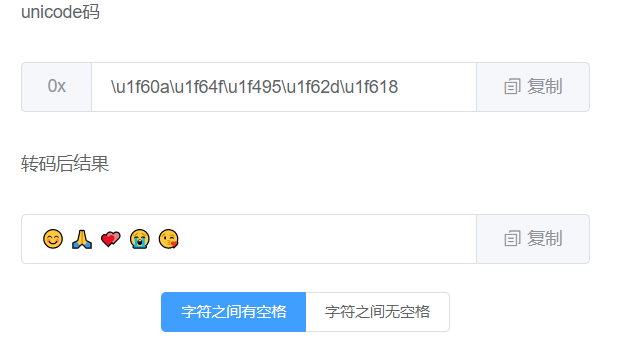

## study

yuchuan 的 Vue 小项目，边学边做。

## 玉川的工具箱

### unicode 转码工具

功能： 提供实时的 unicode 码和字符的双向转码。

网址 <http://tool.myhoney.club/unicode>

演示截图如下：

实现原理：

主要利用`ES6`新增的两个 API

- `codePointAt`
- `fromCodePoint()`

**注意点**：在字符转 unicode 码时，要注意字符之间是否由空格分开，选择对应选项，否则会同时将空格转码。
